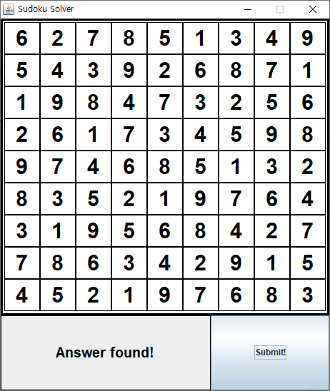

# Sudoku Solver
  > Update date : 2020 / 5 / 21

## 용도
  > 스도쿠를 대신 풀어드립니다

## 사용법
### 프로그램 실행
  - 위의 SudokuSolver.jar 파일을 다운로드 받는다
  - 다음 명령어를 실행한다  
  ```
  java -jar SudokuSolver.jar
  ```
  - 실행화면  
  
### 프로그램 사용
  - 나타난 창에 풀려고 하는 스도쿠를 입력한다
  - 입력 예시  
  
  - 아래의 Submit! 버튼을 누르면 입력된 스도쿠의 정답을 출력한다
  - 정답 예시  
  
  - 답이 없는 경우 정답을 찾을 수 없다는 메세지를 출력한다  
  - No answer 예시  
  

## 수정일
  > 2020 / 5 / 21